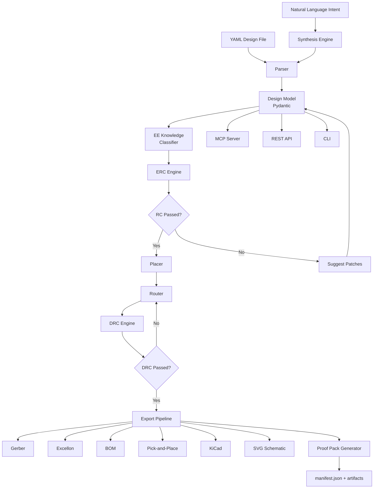

<div align="center">

# ⚡ ZapTrace

### AI-native, verification-first EDA kernel for prompt-to-fab electronics.

**Prompt-to-Fab, with proofs.**<br />
Intent → normalized design → schematic → ERC → placement → routing → DRC → BOM → manufacturing package → auditable proof pack.

<p>
  <a href="https://github.com/oaslananka/zaptrace/actions/workflows/quality.yml"></a>
  <a href="https://github.com/oaslananka/zaptrace/actions/workflows/security-scan.yml"></a>
  <a href="https://github.com/oaslananka/zaptrace/actions/workflows/docs.yml"></a>
  <a href="https://github.com/oaslananka/zaptrace/actions/workflows/scorecard.yml"></a>
</p>

<p>
  <a href="https://oaslananka.github.io/zaptrace"></a>
  <a href="LICENSE"></a>
  
<<<<<<< HEAD
  
=======
  
>>>>>>> 34074d3 (feat: Altium import fidelity corpus gate + MCP tool (issue #137))
  
  <a href="https://www.bestpractices.dev/projects/13403"></a>
</p>

<p>
  <a href="https://oaslananka.github.io/zaptrace"><strong>Documentation</strong></a> ·
  <a href="#quickstart">Quickstart</a> ·
  <a href="docs/development/validation-environment.md">Validation Environment</a> ·
  <a href="ROADMAP.md">Roadmap</a> ·
  <a href="GOVERNANCE.md">Governance</a> ·
  <a href="SECURITY.md">Security</a> ·
  <a href="docs/SAFETY.md">Safety</a>
</p>

<p>
  <a href="https://www.buymeacoffee.com/oaslananka"></a>
</p>

</div>

> [!WARNING]
> **Pre-1.0.** ZapTrace is a verification-first EDA kernel, not a fabrication guarantee. All generated outputs require human engineering review before fabrication or use. See [Safety Disclaimer](#safety-disclaimer).

> [!NOTE]
> **Proof Pack = evidence layer, not absolute correctness.** Proof packs record configured checks, artifacts, assumptions, and pass/fail evidence. A clean proof pack does not mean a board is manufacturer-approved, production-ready, or safe to fabricate without review.

---

## What ZapTrace Is

- **A Python SDK** for programmatic electronics design — parse, validate, place, route, export.
- **A CLI** (`zaptrace`) for quick design iteration from the terminal.
<<<<<<< HEAD
- **An MCP server** (`zaptrace-mcp`) that exposes 90 agent-facing tools to AI agents.
=======
- **An MCP server** (`zaptrace-mcp`) that exposes 90 agent-facing tools to AI agents.
>>>>>>> 34074d3 (feat: Altium import fidelity corpus gate + MCP tool (issue #137))
- **A REST API** for web-based design workflows.
- **A verification engine** — Electrical Rule Checking (ERC) + Design Rule Checking (DRC) baked in.
- **A manufacturing export pipeline** — Gerber RS-274X, Excellon drill, BOM, pick-and-place, KiCad.
- **A proof-pack generator** — auditable, reproducible artifact bundles for every design.

## What ZapTrace Is Not

- ❌ **Not a replacement for KiCad, Altium, or Eagle** — ZapTrace is a *backend engine*, not a full PCB editor GUI.
- ❌ **Not a SPICE simulator** — no analog simulation (yet).
- ❌ **Not a replacement for human engineering judgment** — all outputs require review before fabrication.
- ❌ **Not fabrication-proven** — ZapTrace is pre-1.0. Manufacturing outputs are experimental.
- ❌ **Not fabrication-ready or production-ready** — no claim of fitness for manufacturing is made.
- ❌ **Proof Pack is not a correctness guarantee** — it is an evidence layer that records what was checked and what passed/failed. Absence of errors does not mean the design is correct or manufacturable.
- ❌ **KiCad Oracle (ERC/DRC) is external validation, not absolute correctness** — it catches rule violations the rules know about. A passing KiCad Oracle check does not guarantee a working circuit.
- ❌ **Fab profiles are not manufacturer approvals** — built-in profiles match common manufacturer capabilities, but you must verify against your specific manufacturer's current specifications. Always obtain pre-fabrication approval.
- ❌ **GitHub hardware CI cannot catch all hardware errors** — CI runs on simulated or limited hardware; physical validation (probe, power-up, functional test) is irreplaceable.

---

## Status

| Area | Status |
|------|--------|
| Design parsing | ✅ Implemented |
| Schematic synthesis | ⚠️ Template selection (keyword-matches a pre-built template; not from-scratch synthesis) |
| ERC (Electrical Rule Checking) | ✅ Implemented |
| Component placement | ✅ Implemented |
| Grid-based routing | ✅ Implemented |
| Net-aware smart routing | ✅ Implemented |
| DRC (Design Rule Checking) | ✅ Implemented |
| Net classification (EE knowledge) | ✅ Implemented |
| Copper pour generation | ✅ Implemented |
| Gerber RS-274X export | ✅ Implemented |
| Excellon drill export | ✅ Implemented |
| BOM (CSV + JSON) export | ✅ Implemented |
| Pick-and-place export | ✅ Implemented |
| KiCad schematic export | ✅ Implemented |
<<<<<<< HEAD
| KiCad hierarchical project import | ✅ Implemented |
| EasyEDA Standard import/export (round-trip ≥0.75) | ✅ Implemented (single flat JSON; import-only, no PCB editor) |
| EasyEDA Pro writer (import-only via KiCad) | ✅ Implemented (ZIP+JSONL; distinct from Standard) |
| Altium ASCII schematic import | ✅ Implemented (ASCII export only; OLE binary not supported) |
| SVG schematic rendering | ✅ Implemented |
| Manufacturing ZIP bundle | ✅ Implemented |
| MCP server (90 tools) | ✅ Implemented |
=======
| Altium ASCII schematic import (import-only, no native writer) | ✅ Implemented — ASCII format only; binary OLE .SchDoc not supported |
| SVG schematic rendering | ✅ Implemented |
| Manufacturing ZIP bundle | ✅ Implemented |
| MCP server (90 tools) | ✅ Implemented |
>>>>>>> 34074d3 (feat: Altium import fidelity corpus gate + MCP tool (issue #137))
| Power-tree architecture planner + netlist emit | ✅ Implemented |
| REST API server | ✅ Implemented |
| Design diff | ✅ Implemented |
| Full pipeline (autopilot) | ✅ Implemented |
| Proof-pack system | ✅ Implemented — evidence/sign-off foundation; not a correctness guarantee |
| Plugin system | 🚧 Experimental — signed runtime policy documented; production sandboxing still required |
| Review Studio | ✅ Implemented — human-review panels, proof-pack evidence, benchmark readiness |
| SPICE netlist export | ✅ Implemented foundation — DC gate is evidence/skip aware, not full analog sign-off |
| DFM (Design for Manufacturing) | ✅ Implemented foundation — fab profiles, manufacturing evidence, current/thermal/SI risk reports |
| Multi-board design | 🔮 Planned — post-0.3.0 |
| RF/microwave awareness | 🔮 Planned |

---

## v0.3.0 Release Scope

ZapTrace 0.3.0 is an evidence-hardening release. It adds bounded autonomous sign-off vocabulary, requirements coverage, assumption evidence, KiCad oracle evidence, manufacturing/DFM evidence, component/datasheet/footprint provenance, layout/power/SI/PI risk reports, known-failure benchmark mutation coverage, and Review Studio benchmark readiness panels.

This release still makes no fabrication-readiness claim. A pass means the configured evidence gates did not block; it does **not** mean the design is manufacturer-approved, production-ready, or safe to fabricate without human engineering review.

---

## Quickstart

ZapTrace is pre-1.0 and not yet published to PyPI — install from source:

```bash
git clone https://github.com/oaslananka/zaptrace.git
cd zaptrace
uv sync --all-extras

# Run diagnostics
zaptrace doctor

# Parse and validate a design
zaptrace parse examples/esp32_i2c_sensor_node/design.yaml
zaptrace erc my_design

# Generate manufacturing outputs
zaptrace export manufacturing my_design --output build/board
```

---

## CLI Usage

```bash
# Parse a design YAML
zaptrace parse design.yaml

# Inspect a parsed design
zaptrace inspect my_design

# Run ERC validation
zaptrace erc my_design

# List ERC rules
zaptrace erc-rules

# Place components
zaptrace place my_design

# Route nets
zaptrace route my_design

# Generate BOM
zaptrace bom my_design
zaptrace bom my_design --format json

# Generate design report
zaptrace report my_design --output report.md

# Render schematic SVG
zaptrace svg my_design --output schematic.svg

# Export to KiCad
zaptrace kicad my_design output/kicad/

# Diff two designs
zaptrace diff design_a design_b

# Search library
zaptrace library search resistor
zaptrace library get 0402_10k

# Run full pipeline
zaptrace pipeline --source design.yaml --output build/
zaptrace pipeline --intent "ESP32 I2C sensor node"
```

---

## Python SDK Usage

```python
from zaptrace.core.parser import parse_file
from zaptrace.erc.runner import ERCRunner
from zaptrace.algo.placer import place_components
from zaptrace.algo.router import route_design_smart
from zaptrace.export.manufacturing import generate_manufacturing_bundle
from zaptrace.ee.classifier import classify_design

# Parse
design = parse_file("design.yaml")

# Validate
runner = ERCRunner()
erc_result = runner.run(design)

# Classify nets
classify_design(design)

# Place & route
positions = place_components(design)
routing, route_result = route_design_smart(design, positions)

# Export
bundle = generate_manufacturing_bundle(design, "build/")
print(f"Gerber layers: {list(bundle['gerber_layers'].keys())}")
```

---

## MCP Usage

ZapTrace exposes an MCP server for AI agent integration.

```bash
# Start MCP server (stdio mode)
zaptrace-mcp

# Start MCP server (HTTP mode)
zaptrace-mcp --http --port 8090
```

Configure in your AI client's MCP settings:

```json
{
  "mcpServers": {
    "zaptrace": {
      "command": "zaptrace-mcp"
    }
  }
}
```

See [docs/mcp/quickstart.md](docs/mcp/quickstart.md) for the full tool catalog and prompt templates.

---

## REST API Usage

```bash
# Start API server
zaptrace-api

# Parse design
curl -X POST -H "Content-Type: multipart/form-data" \
  -F "file=@design.yaml" http://localhost:8000/parse

# Run ERC
curl http://localhost:8000/erc/my_design
```

See [docs/GETTING_STARTED.md](docs/GETTING_STARTED.md) for REST API setup and usage.

---

## Manufacturing Export

ZapTrace generates all files needed for PCB fabrication:

| Artifact | Format | Status |
|----------|--------|--------|
| Copper layers | Gerber RS-274X | ✅ |
| Drill file | Excellon | ✅ |
| Bill of Materials | CSV / JSON | ✅ |
| Pick-and-place | CSV | ✅ |
| Manufacturing bundle | ZIP | ✅ |
| KiCad project | .kicad_pcb, .kicad_sch | ✅ |
| Schematic | SVG | ✅ |
| Design report | Markdown | ✅ |

```bash
# Generate everything
zaptrace export manufacturing my_design --output build/board
```

---

## Proof Pack

A Proof Pack is an auditable, reproducible artifact bundle that explains what ZapTrace generated and why.

```bash
zaptrace proof-pack design.yaml --output build/proof-pack
```

Each proof pack contains:
- Design inputs and normalized model
- ERC results (what was checked and what passed/failed)
- DRC results
- BOM and supply-chain overview
- All manufacturing artifacts
- Decision log
- Reproducibility metadata
- Warnings and review checklist

See [docs/strategy/proof-pack-spec.md](docs/strategy/proof-pack-spec.md) for details.

---

## Verification Model

ZapTrace uses a layered verification model. Each layer produces evidence; none is a correctness guarantee.

### Evidence Layers

| Layer | What It Does | What It Does NOT Do |
|-------|-------------|---------------------|
| **Parser** | Validates design YAML structure and constraints | Does not verify circuit functionality |
| **ERC (29 rules)** | Checks electrical rules (net connectivity, pin compatibility, power, power-tree, DNP-aware) | Does not simulate the circuit or verify timing |
| **DRC (16 rules)** | Checks physical design rules (clearance, width, drill) | Does not guarantee manufacturability |
| **KiCad Oracle** | Exports to KiCad and runs KiCad's ERC/DRC as external validation | KiCad may have different rules; a pass does not mean the design is correct |
| **Proof Pack** | Records all verification results, artifact hashes, environment metadata, and decisions | Evidence of what was checked, not a guarantee of correctness |
| **Fab Profiles** | Documents manufacturer capabilities (min trace, min drill, layers) | Not a manufacturer approval; always verify with your fab house |
| **GitHub Hardware CI** | Runs hardware-level integration checks on available runners | Cannot reproduce all real-world hardware conditions; physical testing required |

### What "Verification-First" Means

- Verification is **built into the pipeline**, not bolted on after export.
- Every design artifact has an auditable chain: who checked what, with which tool, and what result.
- The design pipeline stops on hard errors (ERC/DRC failures) and requires explicit override.
- **Human engineering review is mandatory** before fabrication. No automated tool can replace domain expertise.

### Non-Claims

ZapTrace does **not** claim:

- **Fabrication-ready** — no automated verification pipeline can guarantee a board will fabricate correctly.
- **Production-ready** — pre-1.0; APIs and outputs may change.
- **Manufacturer-approved** — fab profiles are reference configurations, not approvals.
- **Guaranteed correctness** — all verification tools have blind spots.
- **Fully automatic manufacturing** — every manufacturing output requires human review and fab house approval.

---

## Architecture



---

## Example Gallery

| Example | Description |
|---------|-------------|
| [ESP32 I2C Sensor Node](examples/esp32_i2c_sensor_node/) | ESP32-C3 reading temperature/humidity over I2C |
| [RP2040 USB HID](examples/rp2040_usb_hid/) | RP2040-based USB keyboard controller |
| [USB-C LiPo Charger](examples/usb_c_lipo_charger/) | USB-C powered LiPo charger with protection |
| [STM32 RS485 Node](examples/stm32_rs485_node/) | Industrial STM32 RS485 Modbus node |
| [nRF52840 BLE Sensor](examples/nrf52840_ble_sensor/) | BLE environmental sensor with nRF52840 |

See [examples/](examples/) for design YAML files and walkthroughs.

---

## Safety Disclaimer

> **⚠️ ELECTRONICS DESIGN IS INHERENTLY RISKY.**
>
> ZapTrace is pre-1.0 software. All outputs — schematics, layouts, manufacturing files — **must be reviewed by a qualified electrical engineer before fabrication or use**.
>
> Incorrect PCB designs can cause:
> - Fire or thermal damage
> - Equipment damage
> - Electrical shock
> - Radio interference (legal liability)
> - Complete system failure
>
> ZapTrace is provided as-is, without warranty of any kind. The maintainers assume no liability for damages arising from the use of this software or its outputs.
>
> **Verification tools are evidence layers, not correctness guarantees.**
> - A passing ERC/DRC/KiCad Oracle check does not mean the design is correct or manufacturable.
> - A valid Proof Pack attests what was checked, not that the design is safe.
> - GitHub hardware CI cannot replace physical testing.
> - Fab profiles are reference configurations, not manufacturer approvals.
>
> **If you are not an electrical engineer, consult one before fabricating any ZapTrace-generated design.**
>
> See [docs/SAFETY.md](docs/SAFETY.md) for the full safety policy.

---

## Roadmap

| Horizon | Focus |
|---------|-------|
| **Current (v0.3.0)** | Evidence hardening: proof-pack sign-off, KiCad oracle gates, governed component/datasheet/footprint evidence, layout/power/SI/PI reports, benchmark corpus, Review Studio readiness panel |
| **Next** | Real board-family fixture expansion: requirements, golden KiCad projects, proof packs, manufacturing exports, mutation cases for all 12 manifest families |
| **Later** | Larger component library, live distributor integrations, deeper routing fidelity, solver-grade SI/PI/thermal integrations, multi-board workflows |

See [docs/ROADMAP.md](docs/ROADMAP.md) for the full roadmap.

---

## Contributing

We welcome contributions! See [CONTRIBUTING.md](CONTRIBUTING.md) for guidelines.

- **Issue tracker**: [GitHub Issues](https://github.com/oaslananka/zaptrace/issues)
- **Discussions**: [GitHub Discussions](https://github.com/oaslananka/zaptrace/discussions)
- **Code of Conduct**: [CODE_OF_CONDUCT.md](CODE_OF_CONDUCT.md)

---

## License

MIT License — see [LICENSE](LICENSE).  
ZapTrace is free for commercial and personal use.

---

## Current Limitations

- **Pre-1.0**: APIs are unstable and may change without notice.
- **No interactive PCB GUI**: Primary surfaces are CLI, SDK, MCP, REST, generated artifacts, and Review Studio evidence views.
- **No fabrication approval**: No claim of manufacturing readiness is made; all outputs require qualified human engineering review.
- **Heuristic analysis**: Current thermal, SI/PI, impedance, current-density, and power reports are evidence pre-checks, not solver-grade sign-off.
- **Algorithmic routing**: Routing is grid/net-aware, but not a professional push-and-shove interactive router.
- **Bounded synthesis**: Synthesis is block/template/requirements driven, not open-ended from-scratch invention for arbitrary circuits.
- **Limited package/library breadth**: Many module, DFN/LGA/aQFN/RJ45/RF land patterns still require datasheet-backed geometry expansion.
- **KiCad Oracle is external validation**: KiCad's own ERC/DRC has limitations. A passing check does not guarantee circuit functionality.
- **Fab profiles are not manufacturer approval**: Always verify against your specific fab house and current manufacturer capabilities.
- **Benchmark pass is regression evidence**: It does not imply fabrication safety or production readiness.
- **GitHub hardware CI ≠ physical testing**: CI cannot reproduce all real-world failure modes.
- **KiCad export is primarily outbound**: Import/round-trip fidelity is still a future hardening area.
- **Plugin system is experimental**: Signed-runtime policy exists, but production sandboxing requires further hardening.

<!-- repo-maturity-links -->
## Repository Maturity and Community Health

ZapTrace is managed as a pre-1.0 professional open-source project. The repository keeps its maturity evidence, governance, contribution expectations, release process, and security posture public so users and contributors can review the project's operating model.

- [Repository maturity report](docs/repo-maturity-report.md)
- [OpenSSF evidence](docs/openssf-evidence.md)
- [OpenSSF gap analysis](docs/openssf-gap-analysis.md)
- [Governance](GOVERNANCE.md)
- [Maintainers and access continuity](MAINTAINERS.md)
- [Support policy](SUPPORT.md)
- [Development standards](docs/development/coding-standards.md)
- [Testing policy](docs/development/testing-policy.md)
- [Release process](docs/development/release-process.md)
- [Dependency management](docs/development/dependency-management.md)
- [Release integrity verification](docs/security/release-integrity.md)

Current maturity target: **Professional OSS / Mature OSS**. ZapTrace does not claim OpenSSF Gold or foundation-grade maturity until independent maintainers/contributors and regular human PR review are demonstrably in place.
